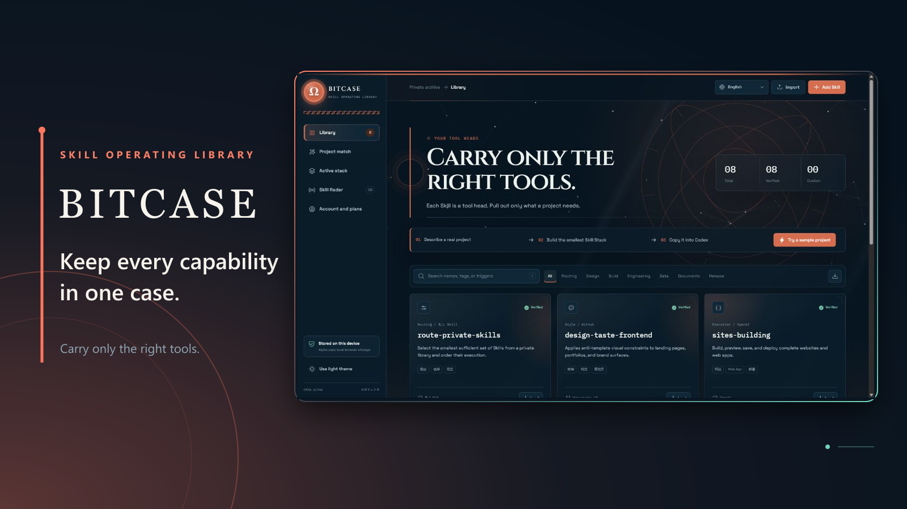

# Bitcase

<p align="center">
  
</p>

<p align="center">
  用于发现、解读、检查、匹配并把 Agent Skills 交给 Codex 的开源能力操作库。
</p>

<p align="center">
  <a href="https://bitcase-skill-library.tomcjq070814.chatgpt.site">在线 Beta</a>
  ·
  <a href="README.md">English</a>
  ·
  <a href="ROADMAP.md">路线图</a>
  ·
  <a href="SECURITY.md">安全政策</a>
</p>

> 这是 Beta 软件。Bitcase 能发现可疑指令和不完整扫描，但不能证明第三方
> Skill 绝对安全。安装前仍应审查源码，并遵循最小权限原则。

## Bitcase 解决什么问题

Agent Skills 分散在 GitHub、登记网站和个人电脑里。收藏链接很容易，但用户
通常仍不知道它具体能做什么、是否能用，以及某个项目究竟需要哪些 Skills。

Bitcase 把收藏过程改造成使用流程：

1. 从 GitHub 或 skills.sh 发现 Skill；
2. 识别仓库内所有 `SKILL.md`；
3. 解释用途、适用场景、限制、权限和风险；
4. 使用内容哈希去重并检测变化；
5. 为项目生成最小 Skill Stack；
6. 生成可以交给 Codex 的可审计清单；
7. 记录每个 Skill 最终是否有用、未使用、冲突或安装失败。

## Beta 已有能力

- 浏览器本地私人 Skill 库及导入导出
- 不消耗模型 Token 的项目匹配
- 带维护、许可证和仓库质量信号的 GitHub Radar
- skills.sh 趋势、热门和总榜发现
- 精确识别多 `SKILL.md` 仓库中的单个 Skill
- 源码检查、内容哈希、风险隔离和重新检查
- 六种语言界面与 Skill 解读
- 项目 Stack JSON 与 Codex 本机安装握手
- 逐个 Skill 使用结果反馈
- 可选 ChatGPT 身份、D1 云端库及 Codex Bridge Token
- 可安装 PWA 和离线外壳

## 本地运行

要求 Node.js 22.13 或更高版本。

```bash
git clone https://github.com/Tomchen070814/bitcase-community.git
cd bitcase-community
npm ci
npm run dev
```

打开 Vite 输出的本地地址。开发环境使用本地 D1 数据库，不需要生产账户或
生产密钥。

需要提高 GitHub API 限额时：

```bash
cp .env.example .env.local
```

然后填写服务端 `GITHUB_RADAR_TOKEN`。不要把它改成客户端变量。

### 为 Radar 接入 Kimi AI

托管站点可直接调用 Cloudflare Workers AI，由 Kimi K2.6 为聚焦、相邻和
跨领域三条搜索路线生成查询。调用只发生在服务端，并受单访客与全站每日额度
保护；当 AI 不可用或额度耗尽时，Radar 会自动回退到本地确定性规划。

生产环境按照 `.env.example` 设置 `BITCASE_AI_PROVIDER=cloudflare`、
`BITCASE_AI_MODEL=@cf/moonshotai/kimi-k2.6`，并配置仅服务端使用的
Cloudflare Account ID 与 API Token。本地开发仍可使用 FreeLLMAPI 适配器。
详见 [Radar 的 Kimi 与 FreeLLMAPI 配置](docs/FREELLMAPI.md)。

验证修改：

```bash
npm run lint
npm test
```

## AgentChat 集成

Bitcase 现在提供
[`Tomchen070814/AgentChat`](https://github.com/Tomchen070814/AgentChat)
仓库中的四个精选 Skill。每个 `SKILL.md` 会被单独选择和检查，生成的 Stack
清单则会保留 AgentChat 的整仓运行时依赖，避免只复制单个目录后无法运行。
配置、环境变量与安全说明见
[AgentChat 集成文档](docs/AGENTCHAT.md)。

## 开源与官方云服务边界

本仓库公开完整 Beta 核心，也包括通用 D1 账户和库同步实现。未来官方
Bitcase Cloud 可能增加全目录同步、个性化排序、反滥用、计费、团队管理及
运营后台；这些能力不影响社区版本地运行。

详细说明见 [社区版与云端边界](docs/COMMUNITY_CLOUD.md)。

## 当前阶段

`0.4.0-beta.1` 适合公开测试，不适合直接用于安全关键环境。下一阶段重点是：

1. 获取真实用户数据；
2. 使用受支持 API 完成登记库同步；
3. 加强来源、许可证与维护状态验证；
4. 形成可复现的 Skill 安装流程；
5. 完成移动端与无障碍实测；
6. 支持 OpenAI Sites 之外的独立账户提供商。

贡献前请阅读 [CONTRIBUTING.md](CONTRIBUTING.md)。安全问题不要提交公开 Issue。

代码使用 [GNU AGPL v3.0 only](LICENSE) 开源。Bitcase 名称和项目标识的使用
边界见 [TRADEMARKS.md](TRADEMARKS.md)。
