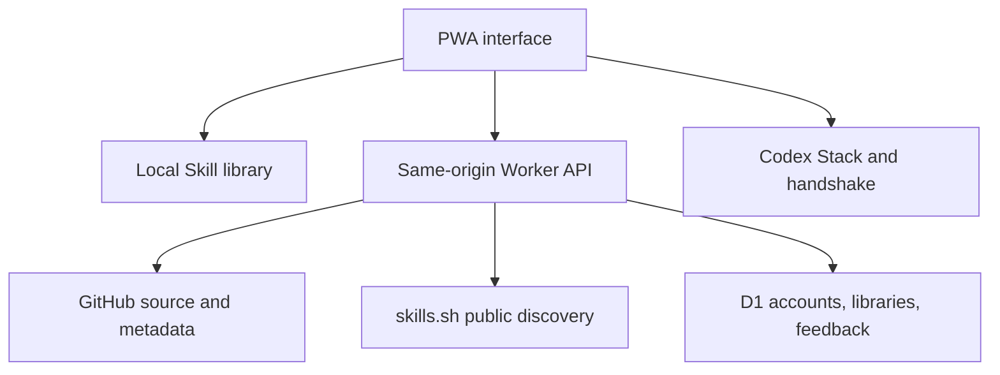

# Architecture

## Runtime shape

Bitcase is a Vinext application deployed as a Cloudflare-compatible Worker.

## Main modules

| Area | Source | Responsibility |
| --- | --- | --- |
| Product UI | `app/BitcaseApp.tsx` | Library, matcher, Radar, Stack, quarantine, account |
| Localization | `app/i18n.ts` | Six supported locales |
| Source inspection | `app/lib/radar-inspection.ts` | Locate, parse, hash, explain, and flag Skill files |
| GitHub discovery | `app/lib/radar-search.ts` | Deterministic search queries and repository signals |
| Registry discovery | `app/lib/skills-network.ts` | skills.sh feed and exact URL resolution |
| Handoff | `app/lib/alpha-three.ts` | Stack identity, installation handshake, quarantine state |
| Persistence | `app/lib/bitcase-cloud.ts` | Accounts, libraries, tokens, and privacy-bounded analytics |
| API routing | `worker/index.ts` | Same-origin validation, limits, API errors, Worker dispatch |
| Schema | `db/schema.ts` | D1 tables and indexes |

## Trust boundaries

### Untrusted inputs

- repository metadata;
- `README` and `SKILL.md` content;
- skills.sh listings and audit claims;
- imported library and handshake JSON;
- project descriptions; and
- browser-local state.

Every boundary validates size and shape. External text is evidence to display,
not an instruction for the Bitcase server or maintainer.

### Authentication

The official Sites deployment can receive ChatGPT identity headers from the
hosting platform. Bitcase never accepts an email supplied by client JSON as
proof of identity.

Deployments outside that platform must replace the identity adapter. Do not
simulate authenticated headers at a public reverse proxy.

### Safety decisions

The inspector provides one of:

- `clean`: no known heuristic finding in the inspected snapshot;
- `warning`: requires human or Codex review;
- `blocked`: strong unsafe pattern or unusable source;
- `missing`: no Skill file was found; or
- incomplete inspection: installation is withheld until checked.

None of these labels is a security certification.

## Data minimization

Anonymous product events use a strict event and metadata allowlist. They exclude
project descriptions, Skill names, repository URLs, source contents, email
addresses, and tokens. Collection is visible in the product and can be
disabled.
