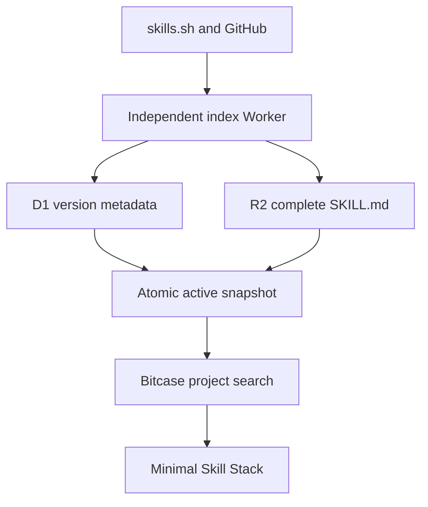

# Bitcase architecture

Bitcase has one product flow:

| Layer | Location | Responsibility |
| --- | --- | --- |
| Product UI | `app/BitcaseApp.tsx` | Visualize Skills, match projects, and compose a Stack. |
| Browser fallback | `app/lib/search-cache.ts` | Retain exact successful query results in IndexedDB for seven days and mark stale fallback visibly. |
| Source inspection | `app/lib/radar-inspection.ts` | Locate, parse, hash, explain, and flag `SKILL.md` files. The filename is legacy; it is the shared source-inspection layer, not a product module. |
| Source resolver | `app/lib/skills-network.ts` | Resolve exact skills.sh and GitHub `SKILL.md` links. |
| Site Worker | `worker/index.ts` | Proxies project matching to the active-snapshot API and permits only user-initiated exact-source visualization. |
| Index Worker | `index-worker/src/index.ts` | Runs scheduled ingestion, circuit breaking, snapshot validation, deterministic ranking, activation, and rollback. |
| Snapshot metadata | `index-worker/migrations/0000_index_snapshot.sql` | Stores versions, indexed Skill metadata, active pointer, source state, and sync history in D1. |
| Snapshot objects | R2 binding `SNAPSHOTS` | Stores complete content-addressed `SKILL.md` files and per-version manifests. |

The active snapshot changes only after all gates pass: at least 90% of the
previous Skill count, at least 95% parse success, and every referenced complete
`SKILL.md` present in R2. Three consecutive source failures open that source's
circuit for one hour. A failed rebuild leaves the previous active pointer
untouched.

The browser persists its selected Skill library and fallback results locally.
There is no account, cloud-library sync, telemetry endpoint, model call,
billing function, or user API-key storage.
