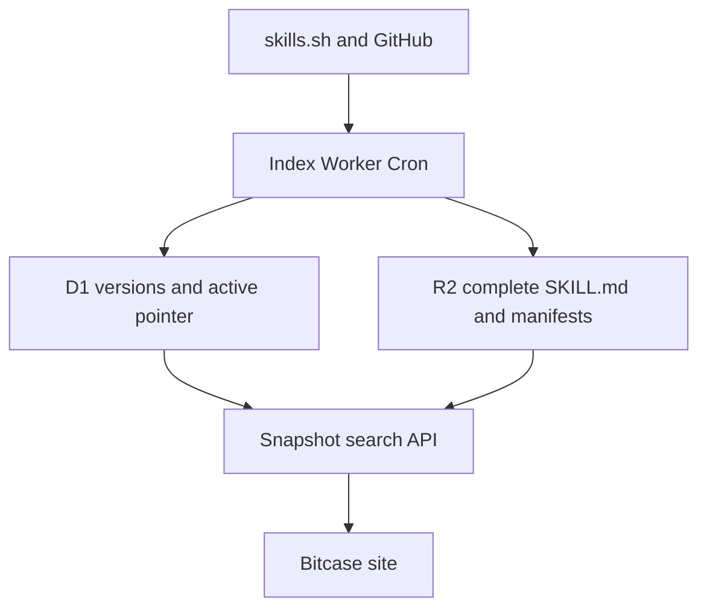

# Bitcase index Worker deployment

`0.4.0-beta.12` keeps user search separated from upstream ingestion and adds
evidence-scoped capability classification:



The site must not be connected to the new API until the first snapshot is
active. Keep the current production site unchanged if any step before
“Connect the site” fails.

## 1. Prerequisites

Install Git, Node.js 22.13 or newer, and npm. In Windows PowerShell:

```powershell
git --version
node --version
npm.cmd --version
npx.cmd --version
```

If PowerShell blocks `npm.ps1`, either use the `.cmd` commands above or permit
signed local scripts for the current user:

```powershell
Set-ExecutionPolicy -Scope CurrentUser -ExecutionPolicy RemoteSigned
```

Clone the beta.12 branch and validate it:

```powershell
git clone https://github.com/Tomchen070814/bitcase-community.git
cd bitcase-community
git checkout agent/bitcase-beta12-evidence-ranker
npm.cmd ci
npm.cmd test
```

Do not continue unless the site build, index Worker dry-run, and all tests pass.

### Upgrading an existing beta.11 Worker

No D1 migration or new R2 bucket is required. Deploy beta.12, then build one
full snapshot. During the interval before that snapshot activates, search uses
conservative compatibility reclassification instead of serving beta.11's
over-broad capability claims.

The first search response after the code deployment may temporarily report:

```json
{
  "rankerVersion": "ranker-v6",
  "snapshotRankerVersion": "ranker-v5",
  "compatibilityReclassification": true
}
```

After the full sync activates, both ranker versions must be `ranker-v6` and
`compatibilityReclassification` must be `false`.

## 2. Authenticate Wrangler

```powershell
npx.cmd wrangler login
npx.cmd wrangler whoami
```

Complete OAuth in the browser. Do not place Cloudflare credentials in this
repository or send them in chat.

## 3. Create D1

```powershell
cd index-worker
npx.cmd wrangler d1 create bitcase-index-prod
```

Copy the returned `database_id` into `index-worker/wrangler.jsonc`, replacing:

```text
00000000-0000-4000-8000-000000000000
```

Keep the binding name `DB`.

Apply the schema:

```powershell
npx.cmd wrangler d1 migrations list bitcase-index-prod --remote
npx.cmd wrangler d1 migrations apply bitcase-index-prod --remote
```

## 4. Create R2

Enable R2 in the Cloudflare dashboard if the account has never used it, then:

```powershell
npx.cmd wrangler r2 bucket create bitcase-index-snapshots-prod
npx.cmd wrangler r2 bucket list
```

Keep the binding name `SNAPSHOTS`. The Worker uses the binding directly; no S3
access key is needed.

## 5. Configure origins and Cron

The committed `wrangler.jsonc` permits only the production Bitcase origin:

```json
{
  "vars": {
    "ALLOWED_ORIGINS": "[\"https://bitcase-skill-library.tomcjq070814.chatgpt.site\"]"
  }
}
```

Do not replace this value with `*`.

The file also owns all three UTC Cron triggers:

| Trigger | Job |
| --- | --- |
| `0 */6 * * *` | refresh skills.sh candidates every six hours |
| `30 */12 * * *` | refresh GitHub candidates every twelve hours |
| `15 2 * * *` | rebuild both sources daily |

Each source invocation inspects at most four repositories and two `SKILL.md`
files per repository. This keeps external calls below the Workers Free
subrequest boundary while query families and result offsets rotate over time.
See the current [Cloudflare Workers limits](https://developers.cloudflare.com/workers/platform/limits/).

Successfully parsed Skills that are not in the current discovery window remain
eligible for eight days. The active beta catalog is capped at 250 Skills and
prefers recently checked evidence. This means catalog growth happens over
successful Cron runs; do not repeatedly trigger manual full syncs to force it.

Manifest source entries expose the active query window, candidate count, and
candidate offset under `discovery` for production diagnosis. The 95% parse gate
is calculated from the fresh batch, not diluted by retained Skills.

## 6. Deploy and add Secrets

The first deploy creates the `workers.dev` service:

```powershell
npx.cmd wrangler deploy
```

Set server-only Secrets:

```powershell
npx.cmd wrangler secret put GITHUB_TOKEN
npx.cmd wrangler secret put SYNC_ADMIN_SECRET
npx.cmd wrangler secret list
```

Generate a strong admin secret in PowerShell:

```powershell
[Convert]::ToHexString(
  [Security.Cryptography.RandomNumberGenerator]::GetBytes(32)
).ToLower()
```

Paste Secret values only into Wrangler's hidden prompt. Never put them in
`.env`, `wrangler.jsonc`, screenshots, issues, or chat.

Deploy once more after setting Secrets:

```powershell
npx.cmd wrangler deploy
```

Record the non-secret Worker URL:

```text
https://bitcase-index-api.<your-workers-subdomain>.workers.dev
```

## 7. Build and activate the first snapshot

Check health:

```powershell
$workerUrl = "https://bitcase-index-api.<your-workers-subdomain>.workers.dev"
Invoke-RestMethod "$workerUrl/health"
```

Load the admin secret into this PowerShell process only:

```powershell
$env:BITCASE_ADMIN_SECRET = Read-Host "SYNC_ADMIN_SECRET"
```

Start the first full build:

```powershell
Invoke-RestMethod `
  -Method Post `
  -Uri "$workerUrl/api/admin/sync/full" `
  -Headers @{ Authorization = "Bearer $env:BITCASE_ADMIN_SECRET" }
```

The result must report `status: active`. Then verify D1:

```powershell
npx.cmd wrangler d1 execute bitcase-index-prod `
  --remote `
  --command "SELECT version_id,status,skill_count,discovered_count,parsed_count,built_at,activated_at FROM index_versions ORDER BY built_at DESC LIMIT 5;"

npx.cmd wrangler d1 execute bitcase-index-prod `
  --remote `
  --command "SELECT * FROM active_index;"
```

Verify the API:

```powershell
Invoke-RestMethod "$workerUrl/api/index/status"

Invoke-RestMethod `
  -Method Post `
  -Uri "$workerUrl/api/search" `
  -ContentType "application/json" `
  -Body '{"query":"制作一个储存和推荐 Skills 的网站","locale":"zh-CN"}'
```

The search response must contain `search.indexVersion`,
`search.rankerVersion`, `search.snapshotRankerVersion`, and at least one
source-backed result for a supported query. For beta.12, both ranker versions
must be `ranker-v6` and `search.compatibilityReclassification` must be `false`.
Repeating the same query against the same version must return the same ordering.

In R2, verify that both of these prefixes exist:

```text
content/<sha256>.md
versions/<version-id>/manifest.json
```

## 8. Connect the site

Only after the first snapshot is active, configure this non-secret site
environment variable:

```text
BITCASE_INDEX_API_URL=https://bitcase-index-api.<your-workers-subdomain>.workers.dev
```

Keep these values out of the site environment:

```text
GITHUB_TOKEN
SYNC_ADMIN_SECRET
```

Build and validate the site before publishing:

```powershell
cd ..
npm.cmd run lint
npm.cmd test
```

## 9. Production acceptance

Confirm all of the following:

- `/health` reports `bitcase-index-worker`.
- `/api/index/status` reports an active version and both source states.
- active snapshots grow across rotating Cron windows without exceeding 250
  Skills or losing the previous active version on a rejected batch.
- the same query, index version, and ranker version produce the same ordering.
- site search logs contain no runtime skills.sh, GitHub Search, GitHub Tree, or
  raw GitHub request.
- `/api/discover`, `/api/inspect`, and `/api/skills-network/resolve` return
  `410 snapshot_only`.
- a rejected build does not change `active_index`.
- three consecutive source failures open only that source's circuit.
- when the index API is unavailable, an exact query cached in the last seven
  days is shown with the stale-data warning.
- when no device cache exists, the site reports index unavailability instead
  of showing an upstream-caused empty result.

## 10. Rollback

Roll back only index data:

```powershell
Invoke-RestMethod `
  -Method Post `
  -Uri "$workerUrl/api/admin/rollback" `
  -Headers @{ Authorization = "Bearer $env:BITCASE_ADMIN_SECRET" }
```

Or select a known ready version:

```powershell
Invoke-RestMethod `
  -Method Post `
  -Uri "$workerUrl/api/admin/rollback" `
  -Headers @{ Authorization = "Bearer $env:BITCASE_ADMIN_SECRET" } `
  -ContentType "application/json" `
  -Body '{"versionId":"<ready-version-id>"}'
```

Roll back Worker code separately:

```powershell
npx.cmd wrangler versions list
npx.cmd wrangler rollback
```

Neither rollback deletes D1 history or R2 source evidence.
